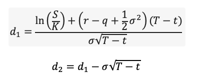
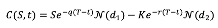
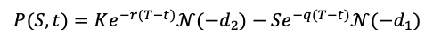

# Black-Scholes-Merton option pricing

The Black Scholes model, also known as the Black-Scholes-Merton (BSM) model, is a mathematical model for pricing an options contract.

The insight
- By combining a position in the option with a position in the underlying security, it is possible to create a portfolio which is riskless over an infinitesimal time period
- No arbitrage implies that, over this infinitesimal time period, the return on this portfolio must be equal to the riskless rate of interest
- These prices do not depend on: risk preference and or the expected return on the underlying security
- So-called “risk neutral” valuation methods are based on this observation

Assumptions
- The stock price follows a geometric Brownian motion with drift μ and volatility σ
- Continuous trading, no restriction on short sales
- No transaction cost, no taxes
- Constant riskless rate of interest

A note on the derivation
- Consider a portfolio consisting of one long option position (say, a call) and short position in some quantity ∆ of the stock: Π = c(S, t) − ∆ × S 
- Consider the change in value of Π from t to t + dt. This change is partly due to the change in the option value and partly due to the change in the stock 
- Also, the change in value is composed of a deterministic part associated with dt and a random part associated with the risk of the stock 
- Since the value of the option is dependent on the value of the stock, we can eliminate the random part by choosing an appropriate ∆ 
- Now we have a portfolio whose change in value is completely deterministic and thus riskless 
- Together with assumptions on the stochastic process that the stock follows we can derive the B-S formula 

Formula

,

with S as the strike price, K as the price of the underlying security, r as the risk-free rate, q the dividend rate, sigma as the standard deviation of the underlying security and T-t being the time to expiration.

- Call (with N as the c.d.f. of a standard normal):

- Put:

### About this code:

#### main.py
This script contains the functions that actually execute the Black-Scholes-Merton calculations. It only needs the math package.

#### example.py 

Has to options to run Black-Scholes-Merton calculations:
1. Option 0: enter all necessary variables manually and calculate the BSM-price of this custom option.

2. Option 1: choose a Ticker, choose the type of option, optionally enter the expected dividend and choose one or multiple option expiration dates. Based on this BSM-prices are calculated for all options of the selected type at the selected expiration date. The results of 'Option 1' calculations can be exported as a csv. 
